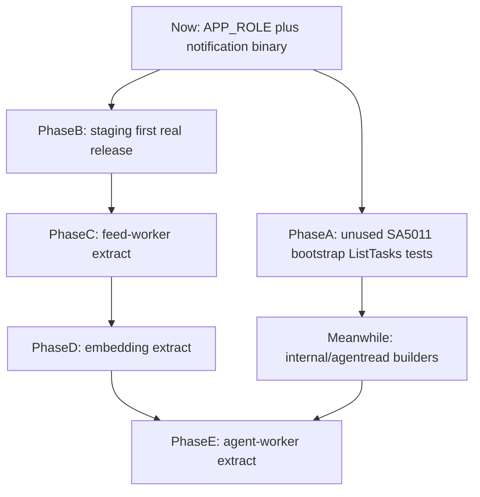

# messageFeed 代码质量与微服务抽取后续实施计划

来源：golangci-lint 全仓扫描、[[messagefeed-backend-evolution-review-plan-20260805]] 归档结论，以及 `docs/micr-k8s` 第 12–14 节未完成项。

## 问题

当前不是「还没开始拆」，而是卡在第三层：

```text
已完成：APP_ROLE 进程角色
已完成：notification 独立二进制 / 镜像 / Deployment
未完成：独立代码包
未完成：独立数据边界
未完成：CI/CD staging 首次真实闭环
未完成：P2 双节点
```

同时全仓 lint 约 191 个问题，热点几乎全在 Agent 读聚合（`ListTasks` / 超长测试），和下一个官方服务 `feed-worker-service` 对不上。若先全仓刷分，会把拆分拖死；若只换入口不收包，会再复制一次 notification「假拆分」。

需要一条可执行流水线，同时满足：

```text
按官方顺序完成独立二进制 / 镜像 / Deployment 上线
  且每个切片抽取后的代码质量明显高于抽取前
  且全仓安全类 lint 不再回潮
```

## 文档关系

| 文档 | 职责 | 本文是否复述 |
| ---------------------------------------------------------------------------- | ------------------------------ | ----------- |
| `docs/nowdoit/archive/messagefeed-backend-evolution-review-plan-20260805.md` | P0 队列可靠性、P1 Agent 持久化 worker | 只引用结论 |
| `docs/micr-k8s/micr-k8s-plan.md` | 架构决策、节点职责、拆分顺序 | 只引用 |
| `docs/micr-k8s/micr-k8s-implement.md` | K3s / Helm / P2 / staging 操作手册 | 只写完成定义，不抄步骤 |
| 本文 | 旧代码怎么改、质量门禁、下一刀服务如何上线与回滚 | 正文 |

P2 双节点（110 装 K3s、Postgres 迁移、Cloudflare 主备）继续以 `micr-k8s-implement.md` 第 14 节为准。本文只把它当作并行轨道和硬门，不重写操作手册。

## 最终目标

1. 官方顺序中的 worker 服务完成独立运行时边界：`notification`（已完成）→ `feed-worker` → `embedding` → `agent-worker`。
2. 每个新服务拥有独立 `cmd/*`、Docker target、Helm 镜像覆盖，以及 `internal/<slice>` 代码缝。
3. 本阶段继续共享 PostgreSQL 队列契约，不引入 gRPC、独立库或消息中间件。
4. 全仓 CI 永久门禁 `unused` 与 `staticcheck`；每个抽取切片对自身包门禁 `funlen` / `gocyclo` / `nestif`。
5. 每个服务可用 `--atomic` 滚动发布，失败可判断并 `helm rollback`。

非目标：

1. 不把 `ListTasks` / Agent 治理看板拆成下一个微服务。
2. 不把全仓 `funlen=80` 做成合并红线。
3. 不在 staging 首次真实发布前抽第二个服务。
4. 不继续只在 `internal/service` 里无限新增 `*_builders.go` 却不形成新包。

## 当前事实基线（2026-08-15）

### 运行与部署

| 项 | 事实 |
| --------------- | ----------------------------------------------------------------------------- |
| 形态 | 模块化单体；同一 Go 模块 |
| 二进制 | `cmd/api`（多角色）、`cmd/notification`（钉死 `notification-worker`） |
| 生产 Helm | release `messagefeed` revision 36，`deployed` |
| API 镜像 | `messagefeed-api:split-20260806` |
| Notification 镜像 | `messagefeed-notification:split-20260806-2` |
| Web 镜像 | `messagefeed-web:allinone-0703de0` |
| 数据库 | PostgreSQL `39,false`，单副本，位于 WSL local-path |
| 当前节点 | WSL `100.78.141.120`，K3s single-server |
| P2 目标节点 | 实体 Linux `100.106.96.110`（尚未装 K3s / cloudflared） |
| CI | `validate` / `publish` / `deploy-staging` 工作流已写；自托管 Runner 未注册，staging 从未真实跑通 |

`APP_ROLE` 已落地：`all`、`api`、`source-worker`、`notification-worker`、`agent-scheduler-worker`、`embedding-worker`、`item-event-worker`、`agent-worker`、`migrate`。cluster 模式禁止隐式 `all`。

### 质量扫描

在可写 `GOCACHE` 下 `golangci-lint run ./...` 得到约 191 个问题（开启 `uniq-by-line: false` 且不截断后）：

| Linter        | 约数  | 含义                   |
| ------------- | --- | -------------------- |
| `gocyclo`     | 71  | 圈复杂度 ≥ 15            |
| `funlen`      | 60  | 函数 > 80 行或 > 50 条语句  |
| `gocognit`    | 20  | 认知复杂度 > 30           |
| `nestif`      | 15  | if 相对嵌套 ≥ 3          |
| `unused`      | 13  | 死代码                  |
| `staticcheck` | 7   | 含 SA5011 可能空指针       |
| `ineffassign` | 3   | 赋值未使用                |
| `gosimple`    | 2   | 可简化转换                |
| `revive`      | 0   | 文件名 / MixedCaps 当前通过 |

最差函数：

| 符号 | 位置 | 指标 |
| ---------------------------------------------------------------- | ----------------------------------------------------- | ------------------------------- |
| `NewP0CapabilityRegistry` | `internal/agent/runtime.go:51` | 330 行 |
| `TestAgentSessionServiceListTasksCombinesPlansAndScheduledTasks` | `internal/service/agent_progress_service_test.go:115` | 517 行、264 语句、圈复杂度 492、认知复杂度 258 |
| `ListTasks` | `internal/service/agent_session_service.go:2429` | 252 语句 |
| `buildDependencies` | `internal/bootstrap/dependencies.go:26` | 认知复杂度 52 |

本机若直接使用默认 `/home/aroen/.cache/go-build` 且进程为 root，可能出现 `permission denied`，golangci-lint 会误报 `no go files to analyze`。本地应使用可写缓存，例如 `GOCACHE=/tmp/go-cache-lint`。

### notification 已验证、但未完成的边界

已完成：独立入口、Docker `notification` target、Helm 仅对该 worker 覆盖镜像、生产切换、`--atomic` 失败自动回滚。

未完成：代码仍走共享 `internal/service` / `internal/repository` / `internal/bootstrap`；数据仍共享 `notification_jobs`、`notification_deliveries`。下一刀必须多做「代码缝」，不能只再加一个 `cmd`。

## 总流程

```text
Phase A  安全 lint + bootstrap 懒装配 + 按子域拆 ListTasks 测试
   与
Phase B  staging 首次真实发布
   并行
         │
         ▼
Phase B 通过后
         │
         ▼
Phase C  feed-worker-service（完整样板：收包 + 独立镜像 + 滚动/回滚 + 切片 lint）
         │
         ▼
Phase D  embedding-service
         │
         ▼
Phase E  agent-worker-service
         （前提：agentread 包已存在，且 feed/embedding 稳定）
```



硬门：

1. Phase B 未完成，禁止开始 Phase C。
2. Phase C 未稳定，禁止开始 Phase D。
3. `internal/agentread` 未形成且 Phase D 未稳定，禁止把 Agent 读聚合提成独立服务；Phase E 只抽执行 worker。

## 设计模式与防劣化规则

后续每一刀都必须遵守仓库里已经在用的模式，而不是另起一套。

| 模式    | 现有落点                                                                | 后续要求                              |
| ----- | ------------------------------------------------------------------- | --------------------------------- |
| 分层    | handler → service → repository → domain                             | 新包保持同一方向，禁止 worker 包反向依赖 handler  |
| 运行角色  | `RolePlan` + `APP_ROLE`                                             | 新 `cmd/*` 钉死角色；cluster 禁止隐式 `all` |
| 任务可靠性 | outbox 表 + `FOR UPDATE SKIP LOCKED` + 租约 + owner 更新                 | 抽取不改状态机语义                         |
| 发布    | expand/contract 迁移 + `helm upgrade --atomic --wait --wait-for-jobs` | 失败先看 migrate Job 与 `/readyz`      |
| 抽取模板  | `cmd/notification` 钉死角色，复用 `bootstrap.New`                          | 下一刀额外要求 `internal/<slice>`        |
| 滚动    | `maxUnavailable: 0`、`maxSurge: 1`                                   | 不改策略，只换镜像                         |

禁止：

1. 为刷全仓 lint 分数拆与当前切片无关的函数。
2. 用独立微服务「顺便」拆 `ListTasks`。
3. 只在 `internal/service` 再加一个 `*_builders.go` 却声称模块化完成。历史已证明：`agent_session_service.go` 从 6255 行降到约 5700 行后，`ListTasks` 仍是 252 条语句。
4. 新 feed 逻辑继续堆进 `internal/service/source_sync_service.go` 而不进 `internal/feedworker`。

旧代码改法口诀：

```text
会挡住下一刀抽取，或属于安全缺陷 → 现在改
属于下一刀服务包内的复杂度 → 跟该服务同一 PR 改
只让全仓 lint 更好看、又不在切片里 → 放着
```

## 质量体系

质量不靠一次全仓刷分，靠三层门禁。

### 层 1：每条 PR（全仓，永远开）

```bash
go test ./...
go vet ./...
GOCACHE=/tmp/go-cache-lint golangci-lint run --disable-all -E unused -E staticcheck ./...
```

CI `[.github/workflows/ci.yml](../../.github/workflows/ci.yml)` 的 `validate` 在现有 `go test` / `go vet` 之外增加上述 golangci 命令。不要把 `funlen` / `gocyclo` 放进这一层。

`[Makefile](../../Makefile)` 的 `lint` 目标应注明可写 `GOCACHE`，避免再出现 `no go files to analyze`。

### 层 2：抽取 PR（只扫该切片）

```bash
golangci-lint run ./internal/feedworker/...
```

过线：该包不再新增 `unused` / SA5011；本切片超长函数拆到可阅读，或在本节「未完成项」写明下一轮。切片外的 `ListTasks`、517 行测试不算本次失败。

### 层 3：上线后（运行证据）

与 notification 验收同一套：

1. Pod `/healthz`、`/readyz` 成功。
2. 队列深度、最老任务年龄、租约回收、死信指标可解释。
3. 重复领取不产生重复业务副作用。
4. 失败 revision 被 `--atomic` 回滚，或已成功 revision 可用 `helm rollback` 回到上一版。

拆出去却不能独立观测、不能回滚，等于质量没过。

---

## Phase A：现在就改（不绑服务边界）

**状态**：implemented（2026-08-17）  
**目标**：去掉安全缺陷和装配耦合，并把 Agent 超长测试按未来子域切开。不发布新服务。

### 验证记录（2026-08-17）

- `golangci-lint run --no-config --disable-all -E unused -E staticcheck ./...` 输出 0 行（unused 13 处已删；SA5011 两处已修；另修 3 处 SA4006，否则层 1 门禁无法全绿）。
- `go test ./...` 全绿；`make fmt` 通过（顺带修了 `source_fetch_job_repository.go` 的存量 gofmt 漂移）。
- ListTasks 测试拆为 fixture + 18 个子域断言函数（表驱动 t.Run，闭包零分支），funlen/gocognit 均过线；子域函数 gocyclo 仍有 3 个 36–43，按「全仓 gocyclo 不做红线」放着。
- CI `validate` 已加门禁；实现与文档命令的差异：加 `--no-config`（否则 `.golangci.yml` 全量 linter 穿透，会拦在 191 个存量上）+ 钉 v1.64.8 安装；新增 `.github/actionlint.yaml` 声明 `messagefeed-staging` 自定义标签。
- 未回滚、未发布新镜像。

### A1. 删除或接上 unused

优先处理确认无调用的符号。删除前用 `rg` 核对该标识符；若测试或未来路径需要，改为未导出并补测试，而不是留导出死代码。

| 符号                                                                    | 文件                                                                         |
| --------------------------------------------------------------------- | -------------------------------------------------------------------------- |
| `responsesOutputText`                                                 | `internal/llm/openai_compatible.go:662`                                    |
| `recentWindowHasEvidence`                                             | `internal/agent/context.go:320`                                            |
| `fake` 测试字段 `input`                                                   | `internal/agent/runner_test.go:908`                                        |
| `agentTranscriptArchiveIndexModelToDomain`                            | `internal/repository/agent_repository.go:1411`                             |
| `updateReadRequest` / `updateFavoriteRequest` / `updateHiddenRequest` | `internal/handler/item_handler.go:89` 起                                    |
| `itemResponseFromDomain`                                              | `internal/handler/item_handler.go:400`（保留 `itemResponseFromDomainForAuth`） |
| `planStepLabel`                                                       | `internal/service/agent_plan_feedback.go:234`                              |
| `earliestTranscriptEntryID`                                           | `internal/service/agent_runtime_adapters.go:2815`                          |
| `historyRecallReason`                                                 | `internal/service/agent_runtime_adapters.go:2854`                          |
| `failTurn`                                                            | `internal/service/agent_turn_result.go:229`（保留 `failTurnWithFeedback`）     |
| `interleaveRecommendationItems`                                       | `internal/service/recommendation_service.go:580`                           |

验收：`golangci-lint run --disable-all -E unused ./...` 为 0。

### A2. 修复 SA5011

两处都是先调用 `s.now()`，后面才判断 `s == nil`。

1. `internal/service/agent_conversation_utils.go` 的 `agentTaskAdmissionDecision`：把 `now := s.now().UTC()` 移到 nil 检查之后，或函数入口立即 `if s == nil { return ... }`。
2. `internal/service/agent_task_router.go` 的 `classifyAgentTaskRoute`：同样先判 `s == nil || s.llmClient == nil`，再取 `s.now()`。

验收：`golangci-lint run --disable-all -E staticcheck ./internal/service` 不再出现这两处 SA5011。

### A3. bootstrap 按 RolePlan 收紧

`[internal/bootstrap/dependencies.go](../../internal/bootstrap/dependencies.go)` 已对 worker 做了部分分支（L116–132），但 `sourceRepository`、`itemRepository`、`agentRepository`、`feedFetcher` 等仍在所有带数据库的角色里无条件构造。

本小轮只做低风险收紧，不重写装配：

1. `source-worker` 不构造 LLM、embedding、auth、conversation、session。
2. `notification-worker` 不构造 source/item/agent 仓储，除非编译期仍被共享类型强迫（若强迫，记录为 Phase C 收包的前置债）。
3. 保持 `plan.SourceWorker` 才构造 `SourceSyncService` 的现有行为。

验收：`go test ./internal/bootstrap/...`；`APP_ROLE=source-worker` 本地启动不要求 LLM 配置。

### A4. 按子域拆 ListTasks 测试

`[TestAgentSessionServiceListTasksCombinesPlansAndScheduledTasks](../../internal/service/agent_progress_service_test.go)` 从 L115 起超过 500 行，对同一个 `ListTasks` 结果做 50+ 个字段断言。名字可以保留；函数体必须按子域切开。

建议用同一个 fixture + 多个 `t.Run`，或按文件拆到 `agent_progress_list_tasks_*_test.go`：

| 子域 | 现有断言起点（约） | 覆盖字段 |
| ------------------------ | --------- | -------------------------------------------------------------------------------------------- |
| 任务合并 | L131–146 | `Tasks` 顺序、ProgressURL、governance 摘要 |
| SLA / cost / alert | L147–164 | `SLA`、`Cost`、`Alerts`、`AlertPolicy`、`CostTrend`、`TrendSnapshot` |
| 部署 / drill | L165–171 | `Deployment`、`Drill`、`LoadTest` |
| WeChat / button | L172 起多处 | `WeChatComponents`、`WeChatNative*`、`Button*`、`WeChatE2E`、`WeChatSignoff`、`WeChatFinalReport` |
| write-gray / audit | 穿插 | `WriteSandbox`、`WriteGray*`、`WriteAudit`、`WriteRamp*` |
| launch / release / daily | 穿插 | `Launch*`、`Release*`、`Daily*`、`Production*`、`Operations*` |

约束：不改 `ListTasks` JSON 字段和审计顺序。

验收：

```bash
go test ./internal/service -run TestAgentSessionServiceListTasks -count=1
golangci-lint run --disable-all -E funlen -E gocognit ./internal/service/agent_progress_service_test.go
```

原函数不再以「264 语句 / 认知复杂度 258」整段失败；允许拆开后个别子测试仍略超阈值，但单测必须短于 80 行或明确只断言一个子域。

### A5. 可选：迁纯 builder 到 `internal/agentread`

在 A4 完成后，若 `buildAgentSLASummary`、`buildAgentTaskCostSummary`、`buildAgentWeChatNativeActions` 等已无 `AgentSessionService` 状态依赖，迁到 `internal/agentread`。`ListTasks` 本体仍留在 `AgentSessionService`。

本项可与 Phase B 并行，不挡 Phase C。

### Phase A 验收

- [x] unused 为 0
- [x] 两处 SA5011 消失
- [x] bootstrap 测试通过
- [x] ListTasks 测试按子域拆开且全绿
- [x] CI `validate` 已加入 unused/staticcheck 门禁
- [x] 不发布新镜像也可以合并
- 备注：A5（迁 builder 到 `internal/agentread`）未做，按计划可与 Phase B 并行、不挡 Phase C。

---

## Phase B：staging 首次真实发布（第二个服务的硬门）

**状态**：planned  
**操作手册**：`docs/micr-k8s/micr-k8s-implement.md` 第 12 节  
**本文只定义「完成」**

现有工作流已具备 `validate` → `publish`（GHCR SHA 镜像）→ `workflow_dispatch` 的 `deploy-staging`（`--atomic --wait --wait-for-jobs --timeout 10m`）。缺失的是外部激活。

完成定义（全部满足才算过门）：

1. 自托管 Runner 标签 `[self-hosted, messagefeed-staging]` 在线。
2. staging namespace Secret 与 `values-k3s.yaml` 引用一致。
3. 一次 `workflow_dispatch` 把 `messagefeed-api:$SHA` 与 `messagefeed-notification:$SHA` 推到 GHCR 并完成 `helm upgrade --install messagefeed-staging`。
4. `kubectl rollout status` 至少覆盖 `messagefeed-api` 与 `notification-worker`。
5. smoke：`/healthz`、`/readyz` 返回成功；记录当时 Helm revision。
6. 若发布失败，`--atomic` 不留下 pending release；记录回滚 revision。

未完成禁止进入 Phase C。P2 是否完成不挡 Phase C，但生产切 feed-worker 镜像前应确认当前仍在 WSL single-server，避免和 110 迁移窗口重叠。

---

## Phase C：feed-worker-service（质量 + 抽取完整样板）

**状态**：planned  
**前置**：Phase B 通过  
**官方名称**：`feed-worker-service`（`micr-k8s-implement.md` 第 13 节第 2 项）

### 为什么是下一刀

1. 已有 `APP_ROLE=source-worker`、Helm Deployment `source-worker`、任务表和租约。
2. 与用户会话、企业微信按钮、治理看板耦合低。
3. notification 已验证「独立入口 + 共享库」；本刀补上 notification 没做的包边界。

### 队列契约（不改语义）

```text
生产者
  source-worker 定时：EnqueueDueSources（task_locks.name=source-sync，只覆盖入队）
  API 手动：POST /api/v1/source-fetches → CreateJob（trigger=manual）
  失败重试：attempt_count < max_attempts → queued / trigger=retry

消费者
  仅 source-worker：ClaimDueJobs → ExecuteFetchJob → UpdateJobIfOwned
```

表：`source_fetch_jobs`、`source_fetch_attempts`。锁字段：`locked_by`、`locked_at`、`lease_until`、`attempt_count`、`max_attempts`。

不搬走：

- `sources` / `items` 表所有权
- `item_events` 所有权（worker 仍可写事件，表归 item-event 切片）
- `POST /api/v1/sources/:id/fetch` 同步抓取路径（`SourceService.TriggerFetch`）。本阶段保持行为，列为后续债，不在本刀改成入队

### 代码步骤

1. 新增 `internal/feedworker`。
2. 迁入消费路径：`SourceSyncService` 的 `RunOnce` / `EnqueueDueSources` / `ExecuteFetchJob`，以及 `SourceFetchJobRepository` 的 `ClaimDueJobs` / `UpdateJobIfOwned` / `CreateAttempt`。
3. API 侧 `SourceService` 只依赖窄接口：

```go
type SourceFetchJobQueue interface {
    CreateJob(ctx context.Context, job domain.SourceFetchJob) (domain.SourceFetchJob, error)
    ListJobsByIDs(ctx context.Context, userID int64, jobIDs []int64) ([]domain.SourceFetchJob, error)
    ListAttemptsByJob(ctx context.Context, userID int64, jobID int64) ([]domain.SourceFetchAttempt, error)
}
```

1. `domain.SourceFetchJob` 等类型留在 `internal/domain`，供 API 与 worker 共享。
2. 新增 `cmd/source/main.go`，抄 `cmd/notification/main.go`，钉死 `APP_ROLE=source-worker`。
3. `Dockerfile` 增加编译 `./cmd/source` 与 `FROM api AS source` target，入口改为 `/app/messagefeed-source`。
4. `deploy/helm/messagefeed/templates/workers.yaml` 对 `source-worker` 增加与 notification 相同的 image override（当前仅 `eq $role "notification-worker"`）。
5. `values.yaml` / `values-k3s.yaml` 增加 `workers.source.image`。
6. CI：`go build` 增加 `./cmd/source`；`publish` 增加 `target: source` → `messagefeed-source:$SHA`；`deploy-staging` 增加 `--set workers.source.image.*` 与 `source-worker` rollout。

### 切片内质量（跟这一刀改）

只整理迁入 `internal/feedworker` 的函数。切片外超长函数一律不动。

```bash
go test ./internal/feedworker/...
go test ./internal/service -run 'SourceSync|SourceService' -count=1
GOCACHE=/tmp/go-cache-lint golangci-lint run ./internal/feedworker/...
```

### 上线、滚动、回滚

发布命令形态（生产仍以当前 WSL release 为准；staging 用 `messagefeed-staging`）：

```bash
helm upgrade --install messagefeed deploy/helm/messagefeed \
  --namespace messagefeed \
  -f deploy/helm/messagefeed/values-k3s.yaml \
  --set workers.source.image.repository="$IMAGE_REGISTRY/messagefeed-source" \
  --set workers.source.image.tag="$IMAGE_TAG" \
  --atomic --wait --wait-for-jobs --timeout 10m
```

滚动：现有 worker 策略已是 `RollingUpdate`、`maxUnavailable: 0`、`maxSurge: 1`；探针走 9090 `/healthz`、`/readyz`；`terminationGracePeriodSeconds: 30`。

双跑窗口：新旧 source 镜像可短暂并存。领取使用 `FOR UPDATE SKIP LOCKED`，完成/失败必须 `UpdateJobIfOwned`。禁止去掉 owner 条件。

回滚判断（命中任一条即回滚）：

1. migrate Job 失败（本刀若无新迁移则不应触发；若误带 contract SQL 会被 expand 门禁拒绝）。
2. `source-worker` Ready 达不到。
3. 9090 `/readyz` 失败。
4. 队列指标查询报错（对照 notification 的 `MIN(scheduled_at)` NULL 事故）。
5. 定时/手动入队后任务长期停在 `queued` 或被非 owner 覆盖。

回滚动作：

- 升级过程中失败：依赖 `--atomic`，确认没有 pending release。
- 升级已成功但业务异常：

```bash
helm rollback messagefeed <previous-revision> --wait --wait-for-jobs
```

旧回滚基线：API 多角色镜像 `messagefeed-api:split-20260806` 仍能以 `APP_ROLE=source-worker` 跑原 Deployment。在独立镜像稳定前不要删除这条路径。

### Phase C 验收

- [ ] 存在 `cmd/source` 与 Docker `source` target
- [ ] 生产/staging Pod PID 1 为 `tini -- /app/messagefeed-source`（或等价）
- [ ] Helm 可单独覆盖 `workers.source.image`
- [ ] `internal/feedworker` 存在，API 不再 import worker 内部 claim 实现
- [ ] `POST /api/v1/source-fetches` 仍能入队；worker 能领取并写 `source_fetch_attempts`
- [ ] `POST /api/v1/sources/:id/fetch` 行为不变
- [ ] 切片 lint 通过；全仓 unused/staticcheck 不回潮
- [ ] 记录发布 revision、回滚演练 revision、队列指标截图或日志

---

## Phase D：embedding-service

**状态**：planned  
**前置**：Phase C 稳定  
**模板**：复用 Phase C，不重复 Helm 手册

额外耦合（必须先处理再抽入口）：

1. 表 `agent_fact_index_jobs`；worker 只消费 `job_type=embed_fact_index`。
2. 仓储方法目前挂在 `AgentRepository` 上，必须先剥到独立 repo。
3. 生产者在 memory consolidation 与 lazy recall，属于 API / agent-worker，本阶段继续共享库调用 `CreateAgentFactIndexJob`。
4. API 与 agent-worker 仍保留 inline embedding client 做召回；本服务只做异步建索引。

不要在本刀抽取 `agent_memory.go` 全文件。验收对照 Phase C：独立 `cmd/embedding`、镜像、Helm override、切片 lint、租约/owner、rollback。

---

## Phase E：agent-worker-service

**状态**：planned  
**前置**：Phase D 稳定，且 `internal/agentread` 或等价读模型包已存在

只抽执行角色：`agent_turns` 队列、`ClaimQueuedAgentTurns`、`RunAgentWorkerOnce`、租约续期、`cancel_requested`、会话 `task_locks`。

不抽：`ListTasks`、`GetProgress`、治理看板 DTO。它们留在 API。`NewP0CapabilityRegistry`（330 行）按 capability 分组注册，作为本刀切片内质量项。

`micr-k8s-implement.md` 第 13 节把 `agent-scheduler-worker` 映射为 `agent-worker-service`。实施时把**持久化 turn worker**（`APP_ROLE=agent-worker`）与**定时任务 worker**（`APP_ROLE=agent-scheduler-worker`）当成两个角色；本 Phase 只抽前者。定时任务 worker 单列后续，避免一次切两条执行链。

---

## 现在改 / 跟拆分改 / 先放

| 问题                                   | 策略                     | Phase         |
| ------------------------------------ | ---------------------- | ------------- |
| unused 13 处                          | 现在改                    | A             |
| SA5011 先 `s.now()` 再判空               | 现在改                    | A             |
| CI 只门禁 unused/staticcheck            | 现在改                    | A             |
| bootstrap 按角色少构造依赖                   | 现在改                    | A             |
| ListTasks 超长测试                       | 现在拆测试，不抽服务             | A             |
| `buildAgent*` 纯函数                    | 迁 `internal/agentread` | A 可选 / 与 B 并行 |
| `ListTasks` 生产函数 252 语句              | 等读模型包稳定后再拆本体           | 不在 C/D        |
| source 消费路径 / claim 仓储               | 跟服务走                   | C             |
| `TriggerFetch` 同步路径                  | 先保持，记债                 | C 之后          |
| embedding job 从 `AgentRepository` 剥离 | 跟服务走                   | D             |
| `NewP0CapabilityRegistry`            | 跟服务走                   | E             |
| 全仓 funlen 红线                         | 先放                     | —             |
| 独立数据库 / gRPC / MQ                    | 先放                     | —             |
| 治理看板独立微服务                            | 先放                     | —             |
| P2 双节点操作                             | 引用 micr-k8s，不在本文展开     | 与 B 并行、不挡 C   |

## 时间盒建议

A 与 B 并行。B 是 C 的硬门。C 稳定后再 D。E 最晚，且依赖读模型包，避免再做一个只换入口的 Agent 假拆分。

P2（110 控制面与 Postgres）按 `micr-k8s-implement.md` 第 14 节单独推进。若 P2 窗口已开始，推迟生产切换 feed-worker 镜像，先在 staging 验证。

## 每 Phase 验证命令（汇总）

```bash
# 层 1
go test ./...
go vet ./...
GOCACHE=/tmp/go-cache-lint golangci-lint run --disable-all -E unused -E staticcheck ./...

# Phase A 测试拆分
go test ./internal/service -run TestAgentSessionServiceListTasks -count=1

# Phase C 切片
go test ./internal/feedworker/...
GOCACHE=/tmp/go-cache-lint golangci-lint run ./internal/feedworker/...
go build ./cmd/api ./cmd/notification ./cmd/source

# 发布后
kubectl -n messagefeed rollout status deployment/source-worker --timeout=240s
# worker /readyz 在 9090；具体端口转发以当时 Pod 为准
helm history messagefeed
```

## 归档约定

1. 每完成一个 Phase，把本节状态改为 `implemented`，补验证记录（命令、revision、是否回滚）。
2. 全部 Phase 完成后，将本文移入 `docs/nowdoit/archive/`，并在 `docs/micr-k8s/micr-k8s-plan.md` 状态段回链。
3. 若实施中发现与 `micr-k8s-implement.md` 冲突，以 micr-k8s 的平台操作为准，以本文的代码缝与质量门禁为准；冲突处改本文而不是静默偏航。
